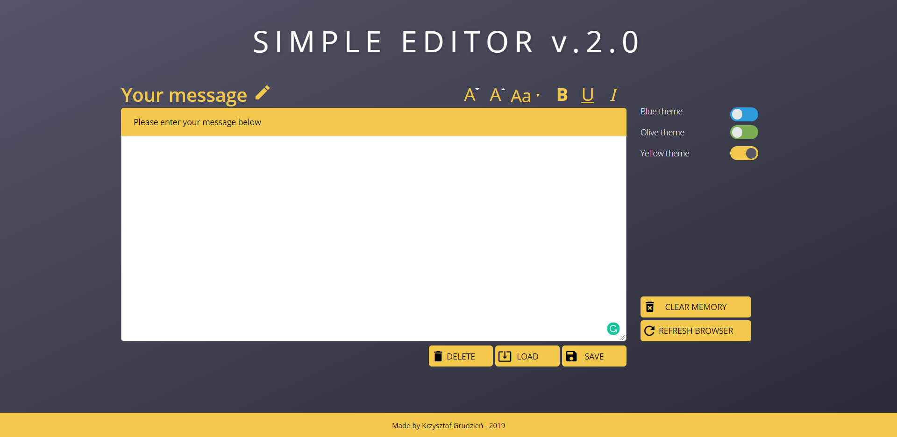

# WTF - The Simple Editor
If you want to know how my editor looks like click here -> [Simple Editor](https://krzysztofgrudzien.github.io/simple-editor/)

## The aim of this project 🚀
The main aim of this project is to put together everything I've learnt so far.

## What I've used here?
- 👍 Semantic HTML5.
- 👍 CSS3 (and a little bit animations) and SASS
- 👍 BEM methodology.
- 👍 Figma aplication.
- 👍 JS ES6 (functions, events, localStorage).
- 👍 GRID and FLEX BOX.
- 👍 Devtools.
- 👍 Solving many issues using Stack Overflow, MDM and others.

## The tools I've used:
- ✔ Visual Studio Code
- ✔ Figma,
- ✔ Task runner - GULP
- ✔ Running environment - Node.js and NPM

## Rules of project 🔔 - PLEASE READ IT BEFORE YOU USE EDITOR
1. Fire up the editor.
2. Write message and ...
  - a) Click SAVE - your message is saved in the localStorage.
  - b) Click LOAD - load saved message.
  - c) Click CLEAR MEMORY - remove message from localStorage.
  - d) Click REFRESH BROWSER - reload browser or press F5.
3. Switch color themes - it's an independent feature.
4. Edit your message - it's an indendent feature also.
 
## I wish you have a fun 🏆

## How to run my local website?

If you want run my website locally, you should follow the instruction below:

`npm install -g gulp-cli`

`npm install`

`gulp`

To publish your page using github pages use `npm run deploy`
